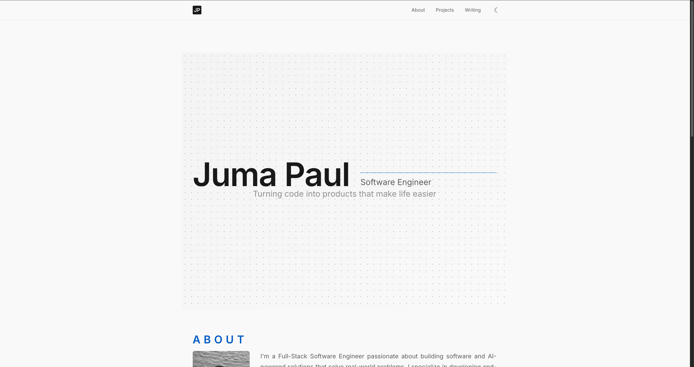

# Portfolio Site

**Live Site:**  
[https://juma-paul.github.io/portfolio/](https://juma-paul.github.io/portfolio/)

Minimal, responsive portfolio site showcasing my projects, skills, and experience.



---

## Tech Stack

- HTML
- CSS
- JavaScript
- GitHub Pages (hosting)

---

## Clone & Run Locally

Follow these steps to run the site on your machine.

### 1. Clone the repository

```bash
git clone https://github.com/juma-paul/portfolio.git
```

### 2. Navigate into the folder

```bash
cd portfolio
```

### 3. Start a local server

```bash
npx serve
```

### 4. Open in browser

Visit:

```
http://localhost:3000
```

---

## Edit Content

Most content is controlled in:

```bash
data.js
```

Update this file to modify:

- Skills
- Projects
- Certifications
- Blog posts

---

## Deploy

Deployment is automatic using GitHub Pages.

```
Push to main - Site updates automatically
```

---

## Project Structure

```text
portfolio/
│
├── index.html
├── style.css
├── script.js
├── data.js
│
└── assets/
    ├── images/
    └── icons/
```

---

## Customization

You can customize:

- Colors (`:root` variables in `style.css`)
- Layout (`style.css`)
- Content (`data.js`)

---

## Features

- Responsive design
- Minimal modern UI
- Dynamic content via JavaScript
- GitHub Pages deployment
- Lightweight and fast loading

---

## Use This Portfolio

You can fork this repository and customize it for your own portfolio.

---

## License

MIT License — free to use and modify.
